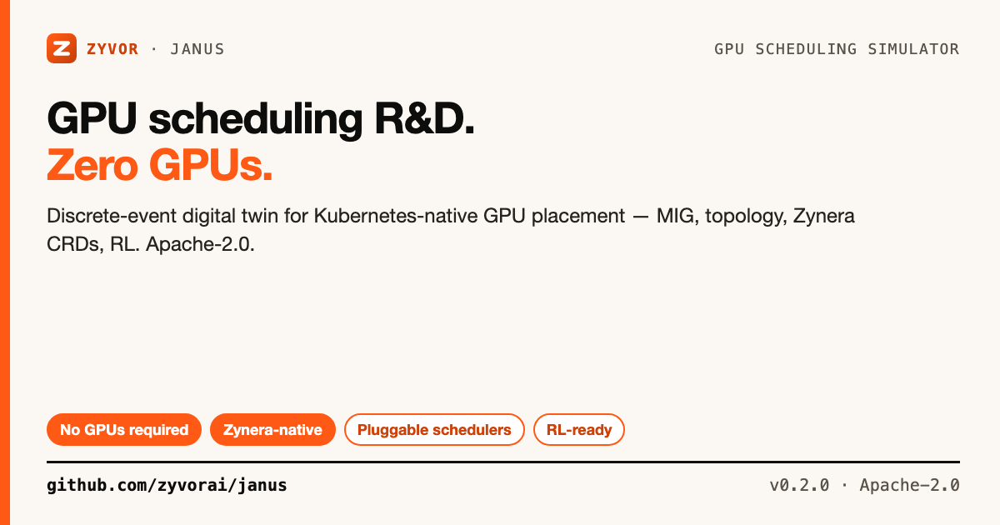

# Janus

[](https://github.com/zyvorai/janus/actions/workflows/rust.yml)
[](https://github.com/zyvorai/janus/actions/workflows/python.yml)
[](https://github.com/zyvorai/janus/actions/workflows/benchmark.yml)
[](https://github.com/zyvorai/janus/actions/workflows/docker-publish.yml)
[](https://github.com/zyvorai/janus/releases)
[](LICENSE)



**A discrete-event simulator for Kubernetes-native GPU scheduling.**

📖 **[Docs](docs/)** · [zyvor.dev/zynera](https://zyvor.dev/zynera) · [Blog](https://zyvor.dev/blog)

Zyvor Janus models clusters, MIG, topology, tenants, quotas, gang scheduling, and AI workloads — so you can develop schedulers, run RL research, and evaluate performance without physical GPUs. It is the digital twin of [Zynera](https://zyvor.dev/zynera), Zyvor's production GPU/Kubernetes control plane.

Shipped profiles cover NVIDIA (H100 through B200, L4, A10G, RTX 4090), AMD MI300X/MI250, Intel Gaudi 3, and Apple M-series.

## Contents

- [Why Janus](#why-janus)
- [Architecture](#architecture)
- [Quick start](#quick-start)
- [Installation](#installation)
- [Project layout](#project-layout)
- [Milestones](#milestones)
- [Zynera input](#zynera-input)
- [Enterprise & support](#enterprise--support)
- [License](#license)

## Why Janus

- **No GPUs required** — full discrete-event simulation of cluster placement, MIG slicing, NVLink/PCIe topology penalties, and gang scheduling
- **Zynera-native** — imports real `FabricAIJob` / `FabricGpuNode` / `FabricQuota` CRDs and replays production scheduler traces for oracle-vs-live diffing
- **Pluggable schedulers** — `fifo`, `priority`, `preemptive`, `bestfit`, and Zynera's own policy, swappable with one CLI flag
- **RL-ready** — Gymnasium environment + PPO baseline for scheduler policy research
- **Full observability** — Rich terminal dashboard, Next.js web UI (runs, benchmark, what-if), OpenAI-compatible inference shim for calibrated LLM serving metrics

## Architecture

- **Rust core** — event engine, cluster model, schedulers, metrics, Zynera bundle loader, inference timing model
- **Python API** — PyO3 bindings, Zynera CRD adapters, Gymnasium env, visualization, FastAPI server, AIPerf adapters
- **Web UI** — Next.js dashboard (runs, benchmark, what-if) + Rich CLI live dashboard

## Quick start

```bash
git clone https://github.com/zyvorai/janus.git
cd janus
cargo run -p zyvor-janus-cli -- run --config configs/clusters/small_h100.yaml
```

A full cluster simulation with no GPU, no Kubernetes, and one YAML file.

<details>
<summary><b>▸ Zynera export bundle</b> — test Zynera without GPUs</summary>

```bash
mkdir -p zynera-export/{jobs,cluster,quotas}
kubectl get fabricaijobs -A -o yaml > zynera-export/jobs/all.yaml
kubectl get fabricgpunodes -o yaml > zynera-export/cluster/nodes.yaml
kubectl get fabricquotas -A -o yaml > zynera-export/quotas/all.yaml

cargo run -p zyvor-janus-cli -- run \
  --zynera-bundle zynera-export \
  --profiles-dir configs/profiles

# Or use the included fixture:
cargo run -p zyvor-janus-cli -- run \
  --zynera-bundle tests/fixtures/zynera \
  --profiles-dir configs/profiles
```

</details>

<details>
<summary><b>▸ Scheduler policies</b> — fifo · priority · preemptive · bestfit · zynera</summary>

```bash
cargo run -p zyvor-janus-cli -- run --config configs/clusters/priority_scheduler.yaml
cargo run -p zyvor-janus-cli -- run --config configs/clusters/preemption_preemptive.yaml
cargo run -p zyvor-janus-cli -- run \
  --zynera-bundle tests/fixtures/zynera \
  --scheduler zynera
```

</details>

<details>
<summary><b>▸ Trace replay</b> — compare vs production Zynera</summary>

```bash
cargo run -p zyvor-janus-cli -- replay \
  --trace tests/fixtures/traces/fifo_match.jsonl \
  --config configs/clusters/single_gpu.yaml
```

Writes `outputs/trace_diff.json` with oracle vs FIFO placement diffs.

</details>

<details>
<summary><b>▸ MIG simulation</b> — fractional GPU slices</summary>

```bash
cargo run -p zyvor-janus-cli -- run --config configs/clusters/mig_single.yaml
```

</details>

<details>
<summary><b>▸ Dual-node preemption</b> — placement migrate (not live CUDA)</summary>

```bash
cargo run -p zyvor-janus-cli -- run --config configs/clusters/dual_node_preempt.yaml
```

This is a **digital-twin placement migrate**. Zynera's production live migrate is KubeVirt VMs — see Zynera docs for Path A / Path B.

</details>

## Installation

### Container images (GHCR)

```bash
docker pull ghcr.io/zyvorai/zyvor-janus-api:latest
docker pull ghcr.io/zyvorai/zyvor-janus-web:latest

docker network create zyvor-janus 2>/dev/null || true
docker run -d --name zyvor-janus-api --network zyvor-janus -p 8080:8080 \
  ghcr.io/zyvorai/zyvor-janus-api:latest
docker run -d --name zyvor-janus-web --network zyvor-janus -p 3000:3000 \
  -e ZYVOR_JANUS_API_URL=http://zyvor-janus-api:8080 \
  ghcr.io/zyvorai/zyvor-janus-web:latest
```

Open http://localhost:3000 (default login `Admin` / `Admin@321` — override via `ZYVOR_JANUS_DASHBOARD_USER` / `ZYVOR_JANUS_DASHBOARD_PASSWORD`). Pin a release with `:vX.Y.Z`.

### Kubernetes

```bash
cd deploy/kubernetes
cp secret.example.yaml secret.yaml   # edit credentials
kubectl apply -f secret.yaml
kubectl apply -k .
```

See [`deploy/kubernetes/README.md`](deploy/kubernetes/README.md).

### From source

```bash
cargo build --release -p zyvor-janus-cli

# Optional: Python bindings + web API
./scripts/setup_dev.sh
source .venv/bin/activate
pip install -e '.[server]'
```

See [`CONTRIBUTING.md`](CONTRIBUTING.md) for `viz`, `rl`, and `dashboard` extras.

## Project layout

```text
crates/              Rust workspace (core, topology, scheduler, simulator, CLI, API, PyO3)
python/              Python package, Gymnasium env, dashboard, baselines
web/                 Next.js UI
configs/             Cluster YAMLs + calibrated profiles
tests/fixtures/      Zynera, traces, AIPerf, benchmark goldens
docs/                Architecture, milestones, UI, benchmark platform, deploy
```

## Milestones

See [docs/milestones.md](docs/milestones.md). **M1–M8 complete**, including topology runtime inflation, gang timeout, RL (M7), and visualization (M8).

**Benchmark platform (MVP shipped):** [docs/benchmark_platform.md](docs/benchmark_platform.md) — inference model, serving traces, score vector, `/benchmark` + `/what-if` UI, OpenAI shim, AIPerf adapter, twin store API, CI golden script.

Schedulers: `fifo`, `priority`, `preemptive`, `zynera` (alias for preemptive), `bestfit`.

## Zynera input

See [docs/zynera_input.md](docs/zynera_input.md) for CRD mapping rules, export workflow, and adapter levels.

## Enterprise & support

Zyvor Janus is the free digital-twin simulator for [Zynera](https://zyvor.dev/zynera). Janus validates scheduling policy offline; Zynera runs it against real GPUs.

| | Zyvor Janus (this repo) | Zynera ([zyvor.dev/zynera](https://zyvor.dev/zynera)) |
|---|---|---|
| **What it is** | Discrete-event simulator / digital twin | Production GPU/Kubernetes control plane |
| **GPUs required** | None — fully simulated | Real GPU fleet |
| **Use case** | Scheduler R&D, RL research, capacity planning, CI gates | Live cluster scheduling, MIG/topology placement, gang scheduling |
| **Input** | Zynera CRD export bundles, YAML configs, trace replay | Live cluster via Fabric CRDs |
| **Support** | [GitHub Issues](https://github.com/zyvorai/janus/issues) | SLA / onboarding — [zyvor.dev/contact](https://zyvor.dev/contact) |

Social assets: [docs/social/](docs/social/).

## License

### Open source (Apache-2.0)

Licensed under the [Apache License, Version 2.0](LICENSE). Personal, lab, and commercial production use at no charge, subject to Apache-2.0 (preserve notices / NOTICE where required).

### Enterprise

Production support, SLAs, and Zyvor Enterprise products are licensed separately.
Contact [sales@zyvor.dev](mailto:sales@zyvor.dev) or see [zyvor.dev](https://zyvor.dev).
